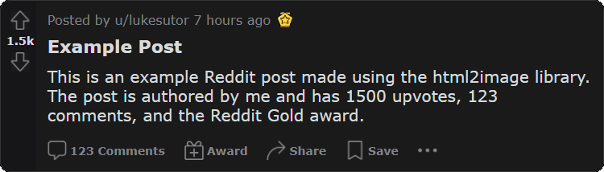

# Social Media Content Generation
This project involves scraping content from reddit and turning it into TikTok / Instagram Reels type posts.  

## The Pipeline:

### 1. Fetching Posts
- First, 100 posts from the past 23 hours are collected from each of the input subreddits using the Reddit OAuth API. The data is then saved to a dataframe including the fields:
    ```
    - Title                 - Body
    - Author                - Upvotes
    - Number of Comments    - Number of Awards
    - Thumbnail             - Awards  
    - Postability           - NSFW Rating
    ```

### 2. Ranking Posts
- These posts are passed through a ranking algorithm to find the most content-worthy one. The algorithm is as follows:
    - Posts must be between 40 and 120 words in length including the title, have no images, and be SFW.
    - If the posts meet the above criteria, a "post-ability" value is calculated based on:  
    `(upvotes / 10) * word_count * (20**num_awards)`  
    This ensures the content is popular and gives a significant favorance to posts with awards.

### 3. If That Fails...
- If the ranking algorithm doesn't find any suitable posts on the first pass, steps one and two are repeated on the next 100 posts in each of the subreddits until there are no more posts to scrape from the endpoints. 
- If there are still no posts meeting the default criteria, the wordcount bounds in the ranking algorithm are increased by 5 words in each direction and all the scraped posts are passed back through. This 10 word increase repeats until a post is found or the total bound increase reaches 500 words, in which an exception is thrown and a post cannot be made.

### 4. Image Creation
- The post with the highest post-ability rating is then passed on to the image creation step in which the `html2image` library is used to create a png image of what the reddit post would look like on the web, including accurate author, upvotes, number of comments, and awards.  

<p align="center">
    
</p>

### 5. Voiceover Creation
- `Amazon Polly` is then used to create a voiceover of the title and description of the post.

### 6. Video Creation
- Finally, the post image, voiceover, and a random snippet of a gaming video are stitched together using `moviepy` to create the post.

## Example Posts:  <br />
<p float="left" align="center">
    </img>
    &nbsp; &nbsp; &nbsp; &nbsp; &nbsp; &nbsp;
    </img>
</p>

<p align="center"><i>Note that the video quality and framerate were greatly reduced due to being converted to a gif. <br />Generated mp4 videos have 1080p quality</i></p>
