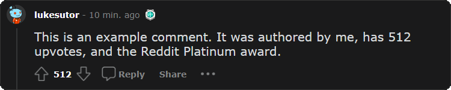
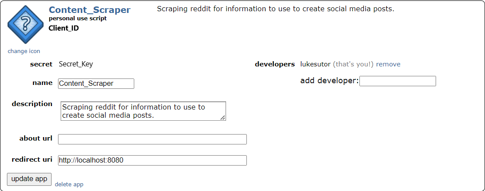

# Social Media Content Generation
This project involves scraping content from reddit and turning it into TikTok / Instagram Reels type posts.  

## The Pipeline:

### 1. Fetching Posts
- First, 100 posts from the past 23 hours are collected from each of the input subreddits using the Reddit OAuth API. The data is then saved to a dataframe including the fields:
    ```
    - Title                 - Body
    - Author                - Upvotes
    - ID                    - Subreddit
    - Number of Comments    - Number of Awards
    - Thumbnail             - Awards  
    - Postability           - NSFW Rating
    ```

- If the user requests a comment to be fetched along with the post, the same process is repeated but for comments. The comment dataframe includes the fields:
    ```
    - Body        - Author
    - Upvotes     - Number of Awards
    - Awards      - ID
    - Avatar      - Postability
    ```

### 2. Ranking Posts
- These posts are passed through a ranking algorithm to find the most content-worthy one. The algorithm is as follows:
    - Posts must be in the user-specified wordcount range including the title, have no images, and be SFW.
    - If the posts meet the above criteria, a "post-ability" value is calculated based on:  
    `(upvotes / 10) * word_count * (20**num_awards)`  
    This ensures the content is popular and gives a significant favorance to posts with awards.
    - Comments have the same ranking process.

### 3. If That Fails...
- If the ranking algorithm doesn't find any suitable posts on the first pass, steps one and two are repeated on the next 100 posts in each of the subreddits until there are no more posts to scrape from the endpoints. 
- If there are still no posts meeting the default criteria, the wordcount bounds in the ranking algorithm are increased by 5 words in each direction and all the scraped posts are passed back through. This 10 word increase repeats until a post is found or the total bound increase reaches 500 words, in which an exception is thrown and a post cannot be made.
- Comments undergo the same further fetching process if a comment can't be found.

### 4. Image Creation
- The post with the highest post-ability rating is then passed on to the image creation step in which the `html2image` library is used to create a png image of what the reddit post would look like on the web, including accurate author, upvotes, number of comments, and awards. Here's an example:

<p align="center">
    
</p>

- The same process is repeated if a comment is scraped. Here's an example:

<p align="center">
    
</p>

### 5. Voiceover Creation
- `Amazon Polly` is then used to create a voiceover of the title and description of the post and corresponding comment.

### 6. Video Creation
- Finally, the post image, comment image (if applicable), voiceover, and a random snippet of a gaming video are stitched together using `moviepy` to create the post.

## Example Posts:  <br />
<p float="left" align="center">
    </img>
    &nbsp; &nbsp; &nbsp; &nbsp; &nbsp; &nbsp;
    </img>
</p>

<p align="center"><i>Note that these examples have very poor resolution and framerate because they were converted to gifs. Generated mp4 videos are 1080p 60fps.</i></p>

## Installing Locally:
First, you need the repository on your local machine. Run the following commands:
```
git clone https://github.com/LukeSutor/content_generation.git
cd content_generation
```
I used Anaconda to manage my dependencies for this project and I recommend you do the same. To set up the anaconda environment, run the following commands.
```
conda env create -n content_generation -f environment.yml
conda activate content_generation
```

After this is done, you need to set up your Reddit dev account and project, Amazon Polly, and this project's .env file.  
<br />

<details>
<summary>1. Setting up the Reddit Dev Account</summary>
<br />
<ul>
    <li>Follow [this link](https://support.reddithelp.com/hc/en-us/requests/new?ticket_form_id=14868593862164) to register to use the Reddit API.</li>
    <li>Once you're registered, follow [this link](https://www.reddit.com/prefs/apps), scroll to the bottom, click "create another app," and create a script.</li>
    <li>Finally, get the app's <code>client ID</code> and <code>secret key</code> (both locations pictured). You will need these for the .env file later.</li>
    <br />
</ul>
<p align="center">
    
</p>
</details>
<br />

<details>
<summary>2. Setting up Amazon Polly</summary>
<br />
<ul>
  <li>Navigate to IAM in your AWS console and set up a new role to use for polly</li>
  <li>Give this new user the permission <code>AmazonPollyFullAccess</code></li>
  <li>Under the Security Credentials tab, create a new access key, saving the <code>access key</code> and <code>secret key</code> to input into the .env file later.</li>
</ul>
</details>
<br />

<details>
<summary>3. Creating the .env File</summary>
<br />
<ul>
  <li>
  The .env file contains 12 mandatory fields
  <ul>
    <li><code>NUM_SCRAPE</code> - The number of posts to scrape on each API call. The reddit limit is 100 posts so this is the recommended value.</li>
    <li><code>WORDCOUNT_BOUNDS</code> - Formatted "lower_bound,upper_bound" upper_bound is noninclusive. These are the default bounds in which the ranking algorithm searches for posts in.</li>
    <li><code>BOUND_INCREASE</code> - The number by which to increase the upper bound if no posts are found that fit into the default bounds. Can be set to zero if you don't want to increase the bounds.</li>
    <li><code>BACKGROUND_VIDEO_DIR</code> - The folder containing the background gaming videos.</li>
    <li><code>SAVE_PATH</code> - The folder to save the created videos and temporary image and audio files to.</li>
    <li><code>CLIENT_ID</code> - The client ID from the Reddit script app.</li>
    <li><code>SECRET_TOKEN</code> - The secret key from the Reddit script app.</li>
    <li><code>REDDIT_USERNAME</code> - The username of the owner of the Reddit scripting app.</li>
    <li><code>REDDIT_PASSWORD</code> - The password of the previously added user.</li>
    <li><code>AWS_REGION</code> - The AWS region of the IAM user created in step two.</li>
    <li><code>POLLY_ACCESS</code> - The access key of the IAM user.</li>
    <li><code>POLLY_SECRET</code> - The secret key of the IAM user.</li>
  </ul>
  </li>
</ul>
</details>
<br />

Once these steps are done, the content generation pipeline can be called in the command line using `python main.py [...arguments]` The arguments are as follows:
- `-s` or `--subreddits ` - The subreddits to gather posts from (required)
- `-n` or `--name` - What to name the created post. If this argument isn't given the default value is the datetime (formatted year-month-date_hours-minutes-seconds)
- `-c` or `--comment` - A boolean option which, if given, will prompt the pipeline to gather a comment with the post.
- `-a` or `-anonymize` - Another boolean option which, if given, will anonymize the user(s) scraped by giving them the username "AnonymousUser" and the default gray avatar.  

For example, if you wanted to scrape the subreddits tifu, AskReddit, and Jokes for a post and comment, you could use the command `python main.py -s tifu AskReddit Jokes -c`